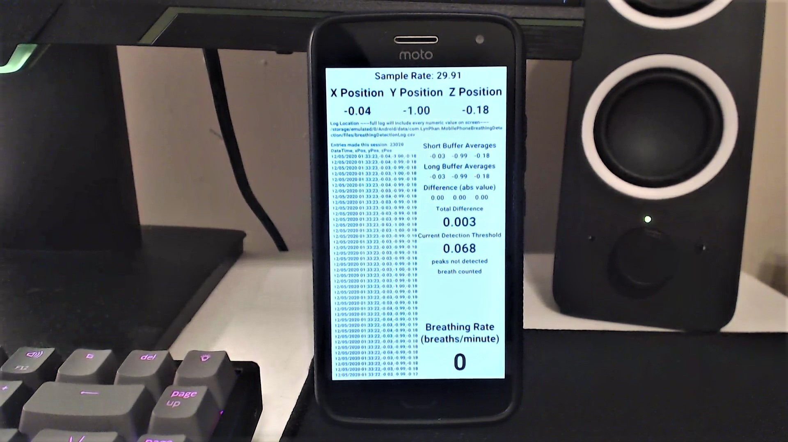

# Table of Contents
- [Basics](#basics)
  * [Objective](#objective)
  * [What Features Does This Have?](#what-features-does-this-have-)
  * [Why Unity Instead Of Native Code?](#why-unity-instead-of-native-code-)
  * [Main Contributors](#main-contributors)
- [How Does This Work?](#how-does-this-work-)
  * [Breathing Detection Algorithm Flowchart](#breathing-detection-algorithm-flowchart)
    + [Glossary (In Order of Relevance)](#glossary--in-order-of-relevance-)
  * [Video Demonstration](#video-demonstration)
- [Sample Logs and Graphs](#sample-logs-and-graphs)
- [Current State of the Project](#current-state-of-the-project)
- [Try It Out](#try-it-out)

[comment]: # (TOC Generator Used: https://ecotrust-canada.github.io/markdown-toc/)

# Basics
## Objective
An cross-platform app that can gather breathing data as cheaply and efficiently as possible for use in a lab environment.

This is important because it allows for accurate breathing detection on a common device, the smartphone. This project can help increase the availability of information on hardware-minimal software-oriented biometric measurement tools, since they can be used where more complicated machinery might not be available.

## What Features Does This Have?
- cross-platform
- accurate breathing detection
- efficient enough to run on phones
- uses as few sensors as possible (especially avoiding gyroscope as many low end phones don't have one)
- full logging capabilities
- enough visual feedback to be easily used in a lab environment

## Why Unity Instead Of Native Code?
- Development time.
  - I only had one semester to complete this before I finished my undergrad degree, so this would be much faster than developing natively.
- Easy cross platform compatibility.
  - This allows for the app to be used on multiple types of phones in our research lab.
- Why not port the original prototype from last spring?
  - The original prototype was done in Max/MSP, which interfaced with phone sensors through the TouchOSC app. This setup was more suited to working with data streams, but required two devices (a computer and smartphone) to operate.
  - There are also no documented or functional APIs for using Max/MSP with Android or iOS at this time of writing.
- Handing off the project to less experienced coders in the future.
  - There was a strong possibility that his project will be passed on to someone else in the lab after I graduated. This unfortunately rules out React Native since that workflow may be too complicated for someone who doesn't code.

## Main Contributors
- Lyn Cassandra Phan (Georgia Tech Brain Music Lab)
  - [phan@gatech.edu](mailto:phan@gatech.edu)
  - [github.com/sheepbun-monster](https://github.com/sheepbun-monster)

# How Does This Work?

## Breathing Detection Algorithm Flowchart

### Glossary (In Order of Relevance)
Peak Detection - Finding maximums in a periodic signal. The algorithm used in this project outwardly functions similarly to peak detection but can be more accurately described as threshold detection.

Position Buffers - Position data from each axis is recorded into a buffer of a certain length.

Position Buffer Averages - All of these values are then averaged to produce an average value for each axis over the time duration of the buffer.

Buffered Average Differences - By getting the magnitude of the difference between a long (minutes long) and short (seconds long) buffered average for each axis, we can calculate how strong the current positional difference is from the norm. Perfect for using with threshold detection.

Detection Threshold - This is the threshold the buffered average differences are measured against. A value greater than this threshold will result in a positive flag raise for a possible detected breath.

Denoising and Debouncing- Removing or ignoring excess positives to reduce the chance for false positives or counting multiple times per breath. Especially useful in continuous live data streams such as this.

## Video Demonstration


# Sample Logs and Graphs

Under construction.

# Current State of the Project
The project is functional but documentation is still a work in progress. Documentation about the algorithm used and procedure will be coming shortly, in addition to videos and pictures.

# Try It Out

If you want to try it out: BreathingDetection/bin/Android/build.apk is the most recent Android build of the software. You'll need to allow apps to be sideloaded on your device
